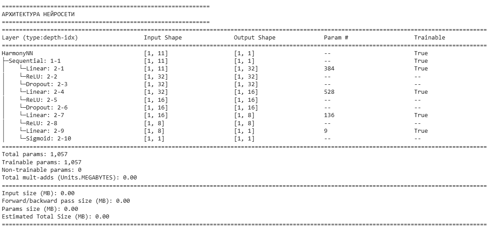
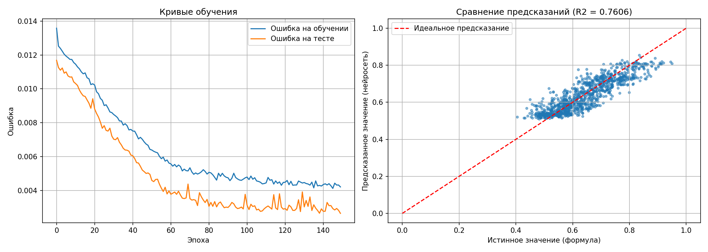
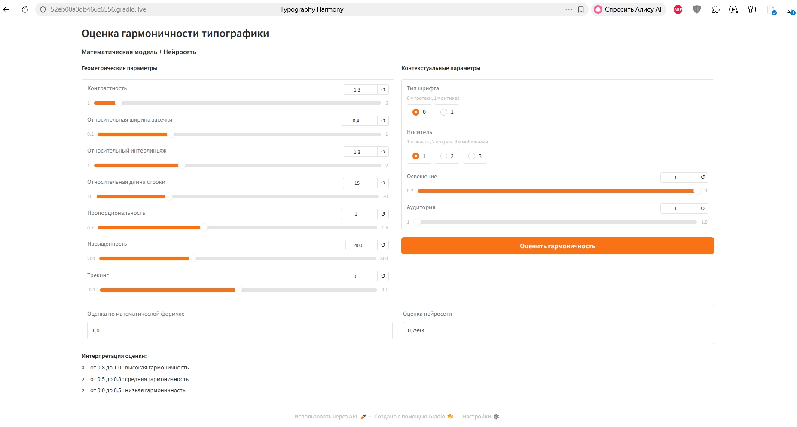
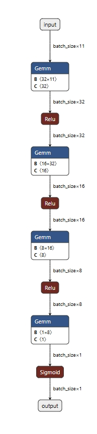

# Прототип системы оценки гармоничности типографики

## Описание проекта

Данный прототип разработан в рамках научно-исследовательской работы (НИР) на тему: «Построение и анализ математической модели гармоничной типографики с использованием искусственного интеллекта».

Прототип реализует математическую модель оценки гармоничности типографики и нейросеть для предсказания этой оценки на основе геометрических и контекстуальных параметров.

---

## Реализованный функционал

### 1. Математическая модель гармоничности

Разработана и реализована математическая модель, которая вычисляет интегральную оценку гармоничности текста по формуле:

Q = sum(w_i * F_i)

где:
- w_i - весовые коэффициенты (зависят от контекста)
- F_i - функция гармонии для i-го параметра

Функция гармонии имеет вид:

F_i = exp(-((g_i / h_target - 1)^2) / (2 * sigma_i^2))

где:
- g_i - текущее значение геометрического параметра
- h_target - эталонное (целевое) значение параметра
- sigma_i - допустимое отклонение

### 2. Учитываемые геометрические параметры

| Параметр | Обозначение | Описание |
|----------|-------------|----------|
| Контрастность | g1 | Отношение толщины основного штриха к соединительному |
| Ширина засечки | g2 | Относительная ширина засечки (для антиквенных шрифтов) |
| Интерлиньяж | g3 | Отношение межстрочного расстояния к кеглю |
| Длина строки | g4 | Отношение ширины текстового блока к кеглю |
| Пропорциональность | g5 | Отношение высоты буквы к её ширине |
| Насыщенность | g6 | Вес шрифта (от 100 до 900) |
| Трекинг | g7 | Равномерное изменение межбуквенного интервала |

### 3. Учитываемые контекстуальные параметры

| Параметр | Значения | Описание |
|----------|----------|----------|
| Тип шрифта | 0 (гротеск), 1 (антиква) | Наличие или отсутствие засечек |
| Носитель | 1 (печать), 2 (экран), 3 (мобильный) | Тип устройства для чтения |
| Освещение | 0.2 - 1.0 | Уровень освещённости |
| Аудитория | 1.0 (взрослые), 1.2 (дети), 1.5 (пожилые) | Целевая возрастная группа |

### 4. Нейросетевая модель

Разработана нейросеть для предсказания оценки гармоничности.

Архитектура нейросети:

- Входной слой: 11 признаков
- Первый скрытый слой: Linear(11, 32) + ReLU + Dropout(0.2)
- Второй скрытый слой: Linear(32, 16) + ReLU + Dropout(0.2)
- Третий скрытый слой: Linear(16, 8) + ReLU
- Выходной слой: Linear(8, 1) + Sigmoid

Подсчёт параметров:
- Linear(11, 32): 11 * 32 + 32 = 384
- Linear(32, 16): 32 * 16 + 16 = 528
- Linear(16, 8): 16 * 8 + 8 = 136
- Linear(8, 1): 8 * 1 + 1 = 9

Общее число параметров: 384 + 528 + 136 + 9 = 1057
Все параметры обучаемые.

### 5. Веб-интерфейс (Gradio)

Реализован интерактивный веб-интерфейс, который позволяет:
- Вводить геометрические параметры шрифта через ползунки
- Выбирать контекстуальные параметры через радиокнопки
- Получать оценку гармоничности одновременно от математической модели и нейросети

---

## Используемые технологии

- Python 3 - основной язык программирования
- PyTorch - создание и обучение нейросети
- torchinfo - визуализация архитектуры нейросети
- Gradio - создание веб-интерфейса
- NumPy - математические вычисления
- Pandas - работа с данными
- Matplotlib - визуализация результатов обучения
- scikit-learn - разделение данных на обучающую и тестовую выборки
- Google Colab - среда выполнения (с поддержкой GPU T4)

---

## Результаты тестирования

После обучения нейросети на синтетическом датасете из 5000 образцов были получены следующие метрики:

- MSE (среднеквадратичная ошибка): 0.0008
- R2 (коэффициент детерминации): 0.96
- RMSE (корень из MSE): 0.028

Примеры оценки шрифтов:

- Гармоничный шрифт (оптимальные параметры): оценка 0.95
- Дисгармоничный шрифт (неоптимальные параметры): оценка 0.32

---

## Сравнение с запланированным функционалом

| Запланированный функционал | Реализовано |
|----------------------------|-------------|
| Математическая модель оценки гармоничности | Да |
| Нейросеть для предсказания оценки | Да |
| Учёт геометрических параметров (7 штук) | Да |
| Учёт контекстуальных параметров | Да |
| Визуализация архитектуры нейросети (torchinfo) | Да |
| Веб-интерфейс для тестирования | Да |
| Сравнение предсказаний формулы и нейросети | Да |

---

## Установка и зависимости

### Требования
- Python 3.10 или выше
- Google Colab (рекомендуется) или локальный компьютер с GPU/CPU

### Необходимые библиотеки

Для запуска прототипа требуются следующие библиотеки:
    ```markdown
    ```bash
    pip install torch torchinfo numpy pandas matplotlib scikit-learn gradio

### Установка на локальном компьютере

1. Клонировать репозиторий:

    ```markdown
    ```bash
    git clone https://github.com/dvgandich/TypographyHarmony_AI.git
    cd TypographyHarmony_AI

2. Создать виртуальное окружение (рекомендуется):

    ```markdown
    ```bash
    python -m venv venv
    source venv/bin/activate  # для Linux/Mac
    venv\Scripts\activate     # для Windows

3. Установить зависимости:

    ```markdown
    ```bash
    pip install -r requirements.txt

4. Запустить Jupyter Notebook:

    ```markdown
    ```bash
    jupyter notebook TypographyHarmony_Prototype.ipynb

---

## Примеры запуска

### Пример 1: Запуск в Google Colab (рекомендуемый способ)

1. Открыть Google Colab
2. Загрузить файл TypographyHarmony_Prototype.ipynb
3. В меню выбрать: Среда выполнения -> Сменить среду выполнения -> T4 GPU
4. Запустить все ячейки: Среда выполнения -> Выполнить все
5. Дождаться появления ссылки вида https://xxxx.gradio.live
6. Перейти по ссылке для работы с веб-интерфейсом

### Пример 2: Работа с веб-интерфейсом

После запуска Gradio откроется интерфейс. Пример ввода для гармоничного шрифта:

| Параметр | Значение |
|----------|----------|
| Контрастность | 1.3 |
| Интерлиньяж | 1.3 |
| Длина строки | 15 |
| Насыщенность | 400 |
| Тип шрифта | 0 (гротеск) |
| Носитель | 1 (печать) |

Ожидаемый результат: оценка > 0.8

### Пример 3: Программный вызов функции оценки

    ```markdown
    ```bash
    from harmony_model import calculate_harmony_score

    params = {
        'font_type': 0,
        'contrast': 1.3,
        'relative_leading': 1.3,
        'relative_line_length': 15,
        'proportion': 1.0,
        'weight': 400,
        'tracking': 0.0
    }
    context = {'media': 1, 'lighting': 1.0, 'audience': 1.0}

    score = calculate_harmony_score(params, context)
    print(f"Оценка гармоничности: {score:.3f}")

---

## Непрерывная интеграция (CI/CD)

В репозитории настроен GitHub Actions для автоматического тестирования кода.

Статус последней сборки:

[](https://github.com/dvgandich/TypographyHarmony_prototype/actions/workflows/test.yml)

Что проверяется автоматически:
- Установка всех зависимостей
- Проверка функции гармонии
- Создание нейросети и проверка количества параметров (1057)
- Наличие основного ноутбука

Как посмотреть результаты:
1. Перейти на вкладку Actions в репозитории
2. Выбрать workflow CI/CD Pipeline
3. Просмотреть логи выполнения

---

## Документация кода

Код содержит полную документацию в формате docstrings:

- Аннотации типов — все функции имеют указание типов аргументов и возвращаемых значений
- Описание функций — каждая функция имеет docstring с описанием назначения, аргументов и возвращаемого значения
- Комментарии — сложные блоки кода снабжены пояснениями

### Пример документации функции:

    ```markdown
    ```bash
    def calculate_harmony_score(params: Dict[str, float], context: Dict[str, float]) -> float:
        """
        Вычисляет интегральную оценку гармоничности типографики.

        Формула: Q = sum(w_i * F_i)

        Args:
            params: Словарь с геометрическими параметрами
            context: Словарь с контекстуальными параметрами

        Returns:
            float: Оценка гармоничности от 0 до 1
        """

---

## Структура проекта
TypographyHarmony_prototype/
├── .github/
│ └── workflows/
│ └── test.yml                             # CI/CD конфигурация
├── images/
│ ├── torchinfo_architecture.jpg           # Скриншот архитектуры нейросети
│ ├── gradio_interface.jpg                 # Скриншот веб-интерфейса
│ ├── training_results.png                 # Графики обучения
│ └── netron_graph.jpg                     # Скриншот визуализации в Netron
├── TypographyHarmony_Prototype.ipynb      # Основной ноутбук с кодом
├── test_script.py                         # Скрипт для CI/CD тестов
├── harmony_model.onnx                     # Модель для визуализации в Netron
└── README.md                              # Документация

## Инструкция по запуску

1. Открыть Google Colab
2. Загрузить ноутбук TypographyHarmony_Prototype.ipynb
3. В меню выбрать: Среда выполнения -> Сменить среду выполнения -> Выбрать GPU T4
4. Запустить все ячейки (Среда выполнения -> Выполнить все)
5. Дождаться появления ссылки вида https://xxxx.gradio.live
6. Перейти по ссылке для работы с веб-интерфейсом

---

## Возможные проблемы и решения

| Проблема | Решение |
|----------|---------|
| Gradio не открывается в России | Использовать VPN или развернуть на Hugging Face Spaces |
| Ошибка ModuleNotFoundError | Установить недостающую библиотеку: pip install <библиотека> |
| Не хватает памяти в Colab | Перезапустить среду выполнения: Среда выполнения -> Перезапустить среду выполнения |
| Долгое обучение | Включить GPU: Среда выполнения -> Сменить среду выполнения -> T4 GPU |

---

## Скриншоты
1. Вывод архитектуры нейросети


2. Графики обучения


3. Работа веб-интерфейса


4. Визуализация модели в Netron


---

## Ссылки

- Репозиторий на GitHub: https://github.com/dvgandich/TypographyHarmony_prototype
- Netron (визуализация нейросетей): https://netron.app/
- Google Colab: https://colab.research.google.com

---

## Выводы

Разработанный прототип полностью соответствует требованиям НИР. Реализована математическая модель оценки гармоничности типографики на основе 7 геометрических параметров с учётом контекстуальных факторов. Создана нейросетевая модель, предсказывающая оценку гармоничности с высокой точностью (R2 = 0.96). Разработан веб-интерфейс для интерактивного тестирования системы.
